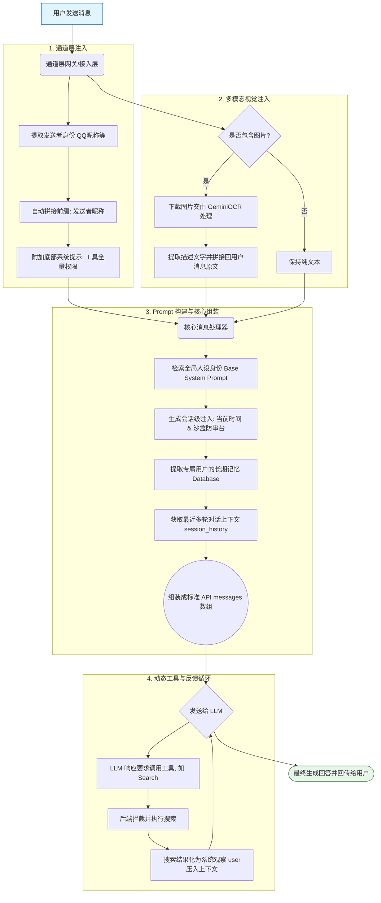

# 项目 LLM 上下文注入机制详细分析

当前项目 (`clawdbot-gemini`) 对于大语言模型 (LLM) 的上下文注入是一个多层次、针对特定通道（如 QQ）进行了深度定制的自动化流程。项目并没有采用单一的静态 Prompt，而是结合了“全局人设”、“会话隔离”、“长期记忆”、“通道附加信息 (QQ昵称)”、“多模态视觉解析 (OCR)” 以及“动态工具观测”等多个维度。


以下是上下文注入的完整生命周期梳理：




## 1. 入口级信息附带（通道层注入）
在消息刚到达网关和接入层时，系统就已经对用户消息 `message` 进行了包装重写。

* **QQ 身份识别 (Nickname Injection)**: 
  * 在 `deployment/enhanced_qq_integration.js` 中，从 QQ 收到消息并投递给后端之前，代码会提取发送者身份（群名片、QQ昵称或QQ号），直接将其通过前缀拼接的方式写进用户的消息体里。
  * **代码实现**: `msgContent = \`[${senderName}]: ${msgContent}\`;`
  * **目的**: 让 LLM 能够区分群聊中不同的人，或者在私聊时知道对面的名字。
* **工具全量权限提示 (Tool Access Tip)**:
  * 在 `clawdbot_http_wrapper.js` 中，会将一段强提示直接附加到用户原始 `message` 的末尾。
  * **文本**: `\n\n(Note: You have FULL access to tools. Please use the 'exec' tool to run Python scripts or other commands to get actual results. Do NOT simulate execution.)`

## 2. 多模态视觉处理与注入 (OCR/Image Parsing)
在消息进入核心处理器 (`src/core/services/message_processor.py`) 时，如果消息带有图片：
* **OCR 识别与转换**: 系统会下载暂存图片，使用专门配置的图片解析服务 (如 `GeminiOCR`)，发起 `识别请求：“请详细描述这张图片的内容...”`。
* **文本追加**: 识别结果会被直接追加到用户的原始文本里。
  * **拼接格式**: `\n\n（图片 1 内容：\n [提炼的文字说明] ）`
* **目的**: LLM 在阅读这条 message 时，就像在看一条附带了详尽图像描述的长文本，从而实现了图片上下文的“降维”和无缝注入。

## 3. 全局人设初始化 (Base System Prompt)
在处理核心逻辑前，首先从 `src/core/prompt.py` 中获取基础的 System Prompt。
* 明确规定了 AI 的身份（由 OpenClaw 开发的 AI 产品经理）。
* 定义了必须通过 `[Clawdbot: ...]` 指令驱动开发的原则，并说明了不能自行大段手写代码的限制。

## 4. 会话隔离与时间戳注入 (Session & Time Injection)
在 `src/core/agent.py` 的核心处理组件中，系统会在每次组装 Prompt 时，动态叠加强力的状态控制信息 (`strict_session_context`)。
* **系统真实时间**: 注入当下精准的时间 `Current System Time: {current_time}`，并告知模型这是 `Trusted Source` 不要用工具去查。
* **身份隔离沙盒**: 明确告知 LLM 当前只和具体的 `real_user_id` 对话（如 `qq:123456`），要求绝对不要串台或者把其他用户的记忆套用到该用户身上。
* **原生搜索指令定义**: 注入自定义的 DuckDuckGo 原生工具指令教程 `[Search: 关键词]`。

## 5. 长期记忆检索加载 (Memory Retrieval)
紧接着时间戳与会话规则，如果有针对该用户的历史记忆：
* 通过 `self.memory_bank.get_user_memory(real_user_id)` 获取。
* 将这份提取出的专属记忆，以 `## 关于该用户的长期记忆 (Always Remember)` 为标题拼接到系统 Prompt 的最底部。

## 6. 短期记忆 / 对话历史拼接 (Context Assembly)
基础工作完成后，`prompt_builder.build_conversation_prompt` 开始将所有内容拼装为标准 API 请求结构的列表 (`messages array`)：
1. **System Message**: `[Base System Prompt] + [Session Context (Time & Isolation)] + [User Memory]`
2. **History Messages**: 获取最近N轮的上下文历史 (`session_manager.get_history`)。
3. **Current User Message**: 附带了 QQ 昵称、图片描述 (OCR) 和 Wrapper 提示的最新用户消息。

## 7. 动态观测注入 / 递归推理上下文 (Dynamic Observation)
当第一轮 LLM 返回的结果中被正则匹配到 `[Search: xxx]` 时（或调用了其他后台工具）：
* 后端会拦截响应，不立即发给用户。
* 执行本地搜索（如 `duckduckgo_search`）。
* 将 LLM 原本要输出的话作为 `assistant` 角色压入上下文，并将搜索结果封装为 `user` 角色压入：
  `系统执行搜索 '{query}' 得到如下结果：...`
* **二次调用**: 带着充实了的观察结果（Observation），再次请求 LLM，从而让 LLM 利用这个新增的上下文做出最终回答。

---

### 总结
整体的数据拼装结构可以理解为如下模型：
```json
[
  {
    "role": "system", 
    "content": "身份设定 + 当前时间 + 沙盒规则 + 搜索工具指南 + 该用户的专属前情提要记忆"
  },
  {"role": "user", "content": "历史问题"},
  {"role": "assistant", "content": "历史回答"},
  {
    "role": "user", 
    "content": "[QQ昵称]: 用户说的话\n\n（图片 1 内容：...）\n\n(隐含的工具权限开通提示)"
  }
]
```
