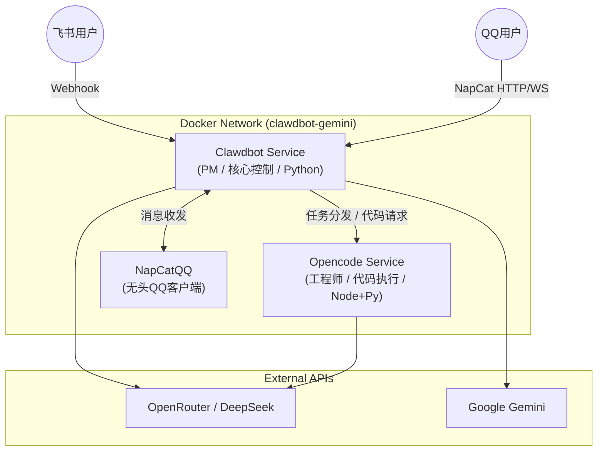

# Clawdbot-Gemini

基于 Docker 的私有化 AI 编程助手，集成飞书与 QQ，采用双服务架构实现“产品经理 + 工程师”的自动编程流。

## 核心架构 (Architecture)

**2026-02-24 更新**:
*   **LLM 上下文注入机制**: 完善了 LLM 上下文的精细化编排机制。引入了通道层前置注入（自动提取群/私聊用户 QQ 昵称）、结合真实时间和严格边界沙盒的 System Prompt 隔离策略、提取专属长期记忆注入、以及支持原生 Web Search 的动态观测（Observation）回注闭环。详情参考新增的 `LLM上下文注入机制.md` 文档。
*   **代码规范**: 全面为核心通信脚本 `enhanced_qq_integration.js` 等补充中文 JSDoc 注释，符合“每个方法附带中文注释”的设计规范以提高可维护性。

**2026-02-16 更新**:
*   **工具完善**: 新增 `scripts/refactor_main.py` 用于代码维护和自动重构。
*   **文档更新**: 更新项目架构说明，涵盖最新的多渠道（QQ/Lark）整合进展。

**2026-02-15 重构更新**: 
*   **服务拆分 (Service Extraction)**: 引入 `MessageProcessor` 处理核心消息流，`IntentDetector` 负责意图识别。
*   **路由重组 (Route Refactoring)**: API 路由迁移至 `src/api/routes.py`，实现模块化管理。
*   **配置管理 (Configuration)**: 统一使用 `Settings` 类管理配置，消除硬编码。
*   **安全性 (Security)**: 增强了 Prompt Injection 防护，实现了用户 ID 净化。
*   **测试 (Testing)**: 增加了单元测试覆盖核心逻辑。



## 功能特性 (Features)

*   **双角色协同**: 
    *   **Clawdbot (PM)**: 负责理解需求、拆解任务、与用户沟通。
    *   **OpenCode (Dev)**: 负责编写代码、执行代码、返回结果。
*   **多端支持**: 同时支持 **飞书 (Lark)** 和 **QQ (via NapCat)**。
*   **安全执行**: 代码在隔离容器中运行 (Python/JS/Bash)。
*   **视觉能力**: 集成 Gemini Vision，支持 OCR 和图片理解。
*   **轻量化**: 默认使用 **内存存储 (Memory Storage)** 管理会话，去除了 Redis 强依赖。

## 快速部署 (Deployment)

### 1. 环境准备
确保已安装 Docker 和 Docker Compose。

### 2. 配置环境变量
复制示例配置并修改：

```bash
cp .env.example .env
# 编辑 .env 填入 API Key 和 飞书/QQ 配置
```

**关键配置项 (`.env`)**:
| 变量名 | 说明 | 默认值 |
| :--- | :--- | :--- |
| `OPENROUTER_API_KEY` | AI 模型密钥 | - |
| `QQ_BOT_ENABLED` | 启用 QQ 机器人 | `true` |
| `ACTIVE_MODEL` | 模型选择 | `openrouter` |

### 3. 启动服务

```bash
docker-compose up -d --build
```

此命令将启动 `clawdbot`, `opencode_service`, 和 `napcatqq` 三个容器。

## 使用指南 (Usage)

### 产品经理模式
用户直接与机器人对话，如需执行复杂编程任务，PM 会自动调用后台工程师。

**手动触发指令**:
```text
[Clawdbot: 你的详细指令]
```
例如：`[Clawdbot: 写一个 Python 脚本查询当前天气]`

### QQ 登录 (NapCat)
首次启动需扫码登录：
```bash
docker logs -f napcatqq
```
扫描终端显示的二维码即可。

## 目录结构 (Structure)

*   `src/`: Clawdbot 核心源码 (Python)
*   `opencode/`: OpenCode 服务源码 (Node.js/Python)
*   `docker-compose.yml`: 主服务编排
*   `napcat_compose.yml`: QQ 服务编排
